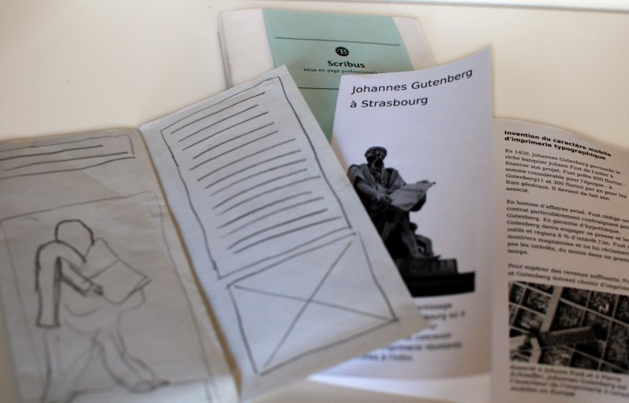
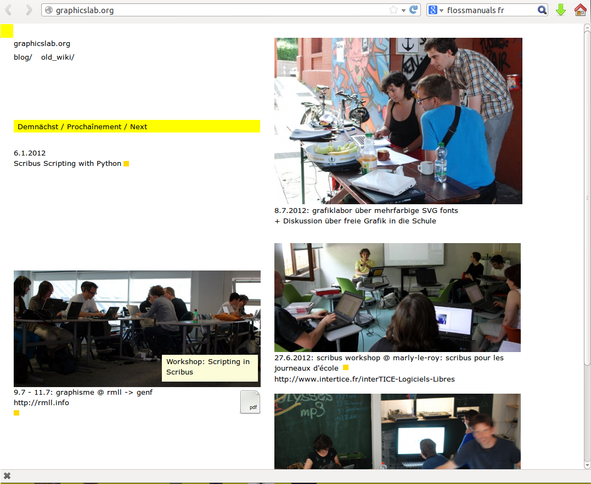

<!---
TODO:
- by the way, the pipe is the first memory i have of the lgm (picture of kiberpipa): a t-shirt i've met at the hostel in lyon and that i've found amazing! but i still haven't managed to buy one...
- martin sayz: the xclip can manage formatting
- another guy says: have a look at jack (libjack)
-->

A Flyer with Scribus

Ale Rimoldi | ale@graphicslab.org

<!---

Bonjour,  je suis un développeur Scribus et je suis là pour vous parler de Scribus et de la création de papillons.

J'imagine que êtes un publique très varié donc...

-->

!

- Qui veut entrendre parler de Scribus ?

- Qui veut apprendre à créer une papillon ?

- Qui veut apprendre à créer un papillon avec Scribus ?

<!--

a/ si vous n'avez jamais utilisé un logiciel de mise en page
b/ si vous êtes intéressés en général comment faire un bon papillon
c/ si vous avez de l'expérience à créer un papillon avec Scribus

!

# Esquisse

!

# Créer un document

- A4, orientation à l'italienne
- 2 pages
- 1 cm de marge

!

Remarques:

- Choisissez l'unité "millimètres"
- Disposition "page simple"

!

# Enregistrez

!

# Repères

- 2 repères verticales

- Goutière de 2 cm

- Origine: "Marges"

!

# Texte

!

# La palette des proprietés

!

# Image

!

# Importer du texte

!

# Lier les cadres

!

# Comparaison

- Office

- Inkscape

!

Ale Rimoldi | ale@graphicslab.org
