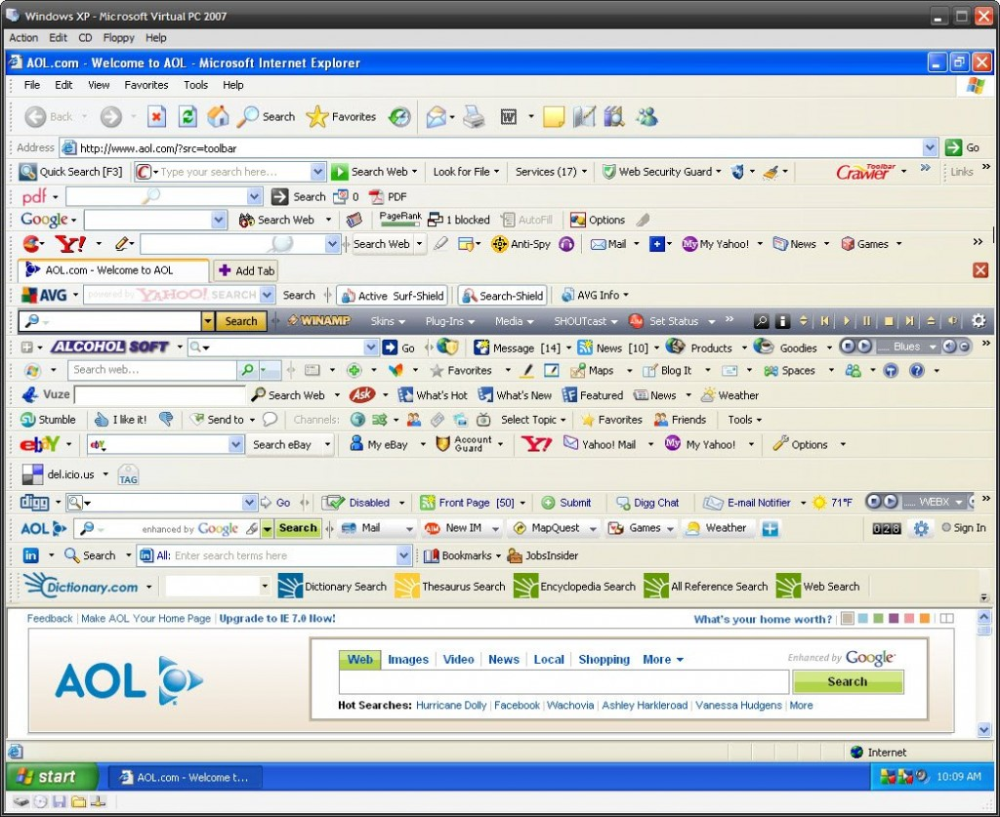
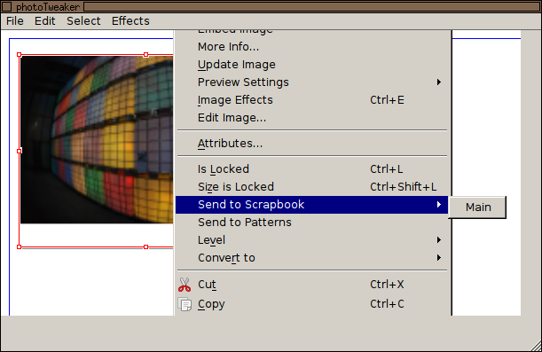

<!---
TODO:
- by the way, the pipe is the first memory i have of the lgm (picture of kiberpipa): a t-shirt i've met at the hostel in lyon and that i've found amazing! but i still haven't managed to buy one...
- martin sayz: the xclip can manage formatting
- another guy says: have a look at jack (libjack)

mention
-->

Ale Rimoldi | ale@graphicslab.org

<!---

Hi. My name is Ale Rimoldi and I'm a Scribus developer -- a Desktop publishing tool -- and one of the organizers of the Libre Graphics Meeting, a yearly get together of the users and develoeprs for the free software for graphics.

This talk will be about integrating "small" tools for graphics with something similar to the Unix pipe.

Around the end of 2012, I took a break from my Scribus activities, and I've been thinking about the world of publishing is evolving and how we – as free software creators – can help the people achieve their goals.

One of the topics that I've been focusng on is: what about creating a zoo of small tools, each solving a specific task, instead of one big monolitic program.

-->

!

Exact measurements → Liquid layout

<!---

My quest started, while I was working on the Epub export plugin for Scribus. One of the main goals was to get a liquid layout from an application that has been conceived to manage fixed – very exact – measurements and proportions.

And I wanted to achieve this without making the Scribus UI even more complex and make the all process as smooth as possible.

-->

!

Complex software → Complex UI?

!

Most people don't seem to really mind.

!

But they are comfortable with phones, tablets...

<!---
But, at the same time, people are getting used to Apps that do only one task. Mostly with a clean, minimalistic interface. On their phones, on their tablet...

-->

!

... and in lot of Flash apps.

<!--
... and on the Web where lots of Flash apps -- but also more and more HTML5 ones -- are making the internet fun to use.
-->

!

Each App being an isoleted island.

<!---

But each one of those applications live in its own world and can't talk to the other ones. Lots of isolated islands, not really what I was looking for. But still inspiring: it made me think about creating small apps with a pipe between them...

-->

!

Well, me I'm just a stupid user...

<!---

This morning at the hostel I've been trying to explain what I was doing to a musician and teacher. After some time his answer whas been: "Well, me I'm just a stupid user and I don't really understand more than what I need to type some text". One thing is sure: he is not stupid! I'm pretty sure that it's his computer that makes him feel stupid. The proof is in the fact that he admits that he feels comfortable with phone and tablet Apps that each do one single step in a complex interaction with his tool. 

-->

!

Est-ce que ceci est la |?

<!--

As I've said at the beginning of this talk, I've been inspired is coming from the Unix pipe.

For those who don't know about it, the unix pipe is a sort of command, that can be put between between the name of two programs and will result in the output for the first program, being piped into the second program, which will do what it's needed.
-->

!

    $ ls -al | cut -c14-16,21- | sort -k5
    
    ale 102034 Apr  9 18:12 scribus.png
    ale 108759 Apr 11 17:27 pipe.jpg
    ale  15205 Apr 11 17:32 android.jpg
    ale 176818 Apr 11 18:14 photoTweaker.png
    ale  20040 Apr 12 08:26 pipe_talking.png
    ale   2374 Apr 12 08:26 pipe_file.png
    ale 251207 May  5  2011 toolbars_many.jpg
    ale  25829 Apr 10 22:50 mikado.png

<!--
The Unix pipe is a very powerfull tool, that in a rather simple way, make programs communicate. The basic principle being, that each program can read text as input and can output text as a result of the process.
But already this rather simple example, shows the limits of the pipe: I've tried to list the files in the current directoy and get them sorted by size -- well, without using the built-in option -- the size is sorted by it's alphabetic order, not the numeric one: so 20040 comes before 2374. Not that I doubt that there is a way to get it done with the pipe and a few more tools or options! But you can guess that with more complex data, as example graphical ones, the complexity can very fast become unmanegeable.
-->

!

Terminology: a graphical terminal

<!---
Let's take inspiration from what is already around...
Not only has Enlightenment surprised us with a release after 12 years of development, but they are also working on giving us a terminal with multimedia capabilities...
-->

!

A GUI inspired by node based editors?

<!---
Still, the terminal feels very old. It's Very effective for many tasks, but I'm sure that we can found alternative ways to use a pipe.

There is a node based photo editor that is in its starting blocs (and should have been presented here) and -- if I look at it -- it much closer to what I imagine a Pipe for graphics should look like
-->

!

The Phatch way

<!---
One sampe of the way this could be look like is also Phatch, a very nice image batch processor. But will this scale for tasks that are very diverse?
-->

!

XML could be the glue

<!---
One of the comments I've most heard is: just use XML. Yes, not a bad idea: but! XML is just a set of formatting rules. What we need is an agreement on the grammar. Even if XML is not really known to be a lightweight solution to any problem, it's certainly worth to be considered!
-->

!

How "fat" can the pipe be?

<!---

So, the next big question: how can we provide a generic way for the programs to communicate? If we leave the Unix convention of only piping raw text, we may have to put more "intelligence" into the pipe itself. One solution could be that the pipe is responsible for mediating between the "left" and "right" application buy asking them which formats they can manage and find the "best" common one.

-->

!

I've tried it out!

<!--
I have a problem: when doing support for Scribus, I often need to share screenshots to show how to do things. Here, how i can do it in a few seconds:

-->

!

Taking the screenshot ...

<!--
- xyz to take a screnshots of the full screen.
-->

!

... cropping and scaling...

<!--
- piping it to the photoTweaker
-->

!

... uploading ...

<!---
- piping to a script that uploads to an image bin and returns returns the address. Of course, you won't see the image on the website.
- piping to the url to the X11 clipboard
-->

!

<!---
- and with right clik it's pasted into my IRC client
-->

... show it!

!

Piping filenames

<!---
Being far from having at hand a fancy communication channel, this prototype sticks to a plain old shell script and to hand over resources bytheir names (file name or http addresse). We clearly need more!
-->

!

And what about the publishing world?

<!---

Back to the Epub exporter. In Scribus, every bit is geared towards defining positions, sizes and colors in the most absolute and picky way. So most of my  effort went into guessing what the designer's thoughts could be and find rules that would provide a pleasant Epub, with a layout that would magically adapt to the characteristics of the ebook readers and finally get a liquid layout. While minimizing the effort needed in producing the Epub. Both from the point of view of the additional configuration to be done in Scribus and of the tweaking that will be necessary on the generated Epub. But you already heared about it from Claudia.
-->

!

/me likes HTML and CSS.

<!---

Here in Brussels, we have OSP -- Open source publishing -- an artiste collective, and they announced at the last LGM in Madrid that they will be go for some trials and error in producing their PDFs with HTML and CSS. It's worth to be followed!

-->

!

Ale Rimoldi | ale@graphicslab.org

<!---
So, we still don't have a pipe to work with. It's seomething we still have to create, that we have to invent. And the biggest issue: how can we create something as simple simple as the unix pipe, but get it to pipe rich content in a way that it is easy to manage for both the "sender" and the "receiver".

-->
