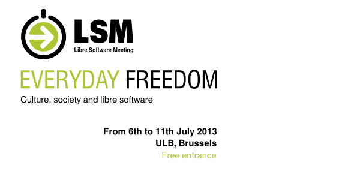
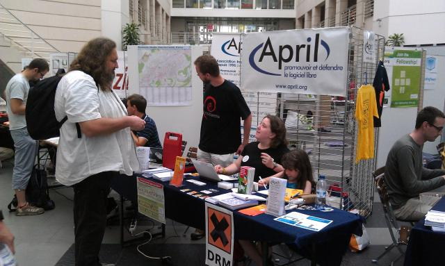
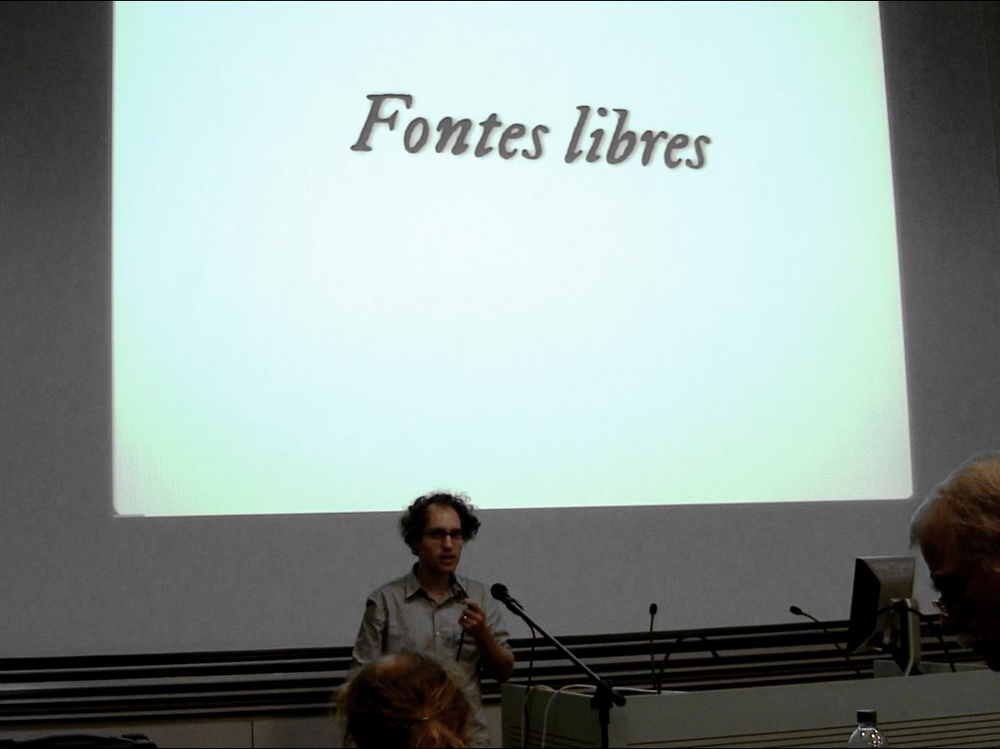
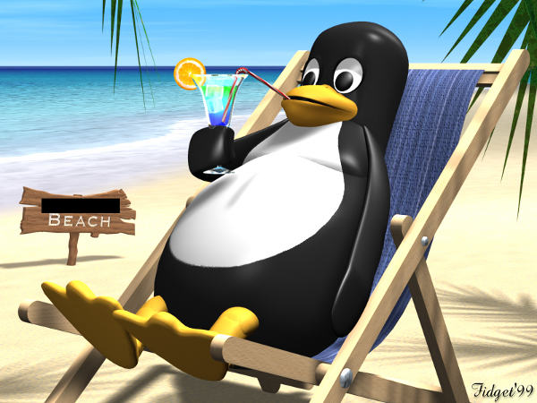
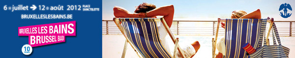
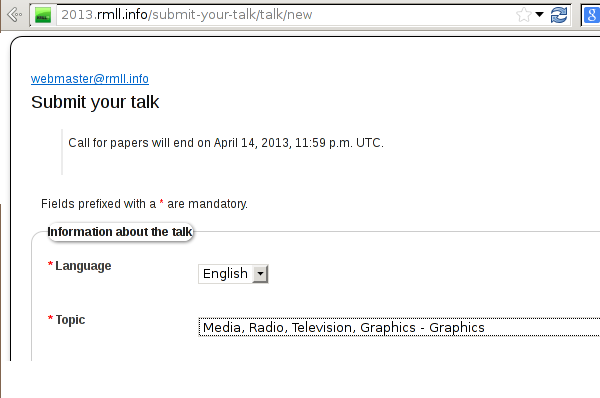

<!---
- se syntax=markdown
- sy on
- se linebreak
- terminal font size = huge
-->

Ale Rimoldi | ale@graphicslab.org

<!---
I'd like to talk about an event that will be happen this summer and that I think could be complentary to what we are doing here. Both from the people being there and the time of the year when it happens. 

The Libre Software Meeting – better knwown as Rencontres Mondiales du Logiciel Libre – which will be held in Brussels from July 6th to 11th.

For those who have never heard about it, it's the 17th edition of the biggest "French" meeting on free software.
-->

!

<!---
In the last few years, they've tried hard to be a truly world wide meeting and the 2012 edition took place in Geneva, in a location which was about 8 Km out of the borders to France.

And the RMLL will be in Brussels, which is a few kilometers more from the french borders and is even a bilingual town.

-->
!

<!--

Last year we tried to give a more "professional" touch to the "Graphics" theme and we would like to repeat what has been a very good experience.

-->

!

Brussels, July 6th to 11th.

<!--
I know, when you think of July you think of holidays...
(Btw, I too this picture from the internet and I've censured to comply to the Python rules... and I hope it's ok to show naked pinguins... 

-->

!

<!--

Well, Brussels is not that bad in summer...

-->

!

http://2013.rmll.info/en/cfp.html

<!---

Ok, back on track.

You're invited to submit a talk, a workshop or other forms of activities before next Sunday on midnight. What we would like to have most are...

-->

!

Geared towards non-graphics-designers using free tols in NGOs and other professional environments.

- Production of brochures or magazines
- Picture editing and management
- ‥

!

Promoting a more active participation in the graphics software among the participants of the RMLL.

- introduction to scripting
- interesting libraries and algorithmes
- hackaton
- ‥

<!---

And this is where I put the biggest weight: people are looking for programmers at the LGM, but the coders are at the Geek convetions...

-->

!

!

Introduce professional graphic designers to the world of free software.

- generative design
- creative hacks
- ‥

<!---

And this probably the most ambitious idea... but, who knows, it could work...

-->

!

http://2013.rmll.info/en/cfp.html

<!--

We already got some very interesting proposals, but we still need talks, workshops and other activities. Your kindly invited to submit your proposition before next Sunday, April 14 by filling the form linked at the bottom of the call for papers:

-->

!

http://2013.rmll.info/en/cfp.html

Ale Rimoldi | ale@graphicslab.org
